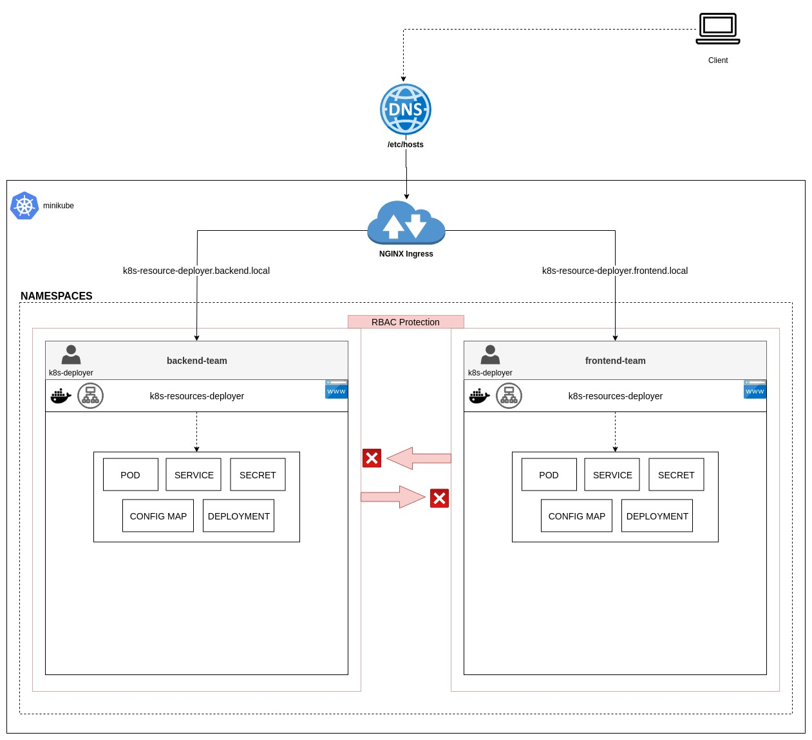

# k8s-resources-deployer Architecture
This document describes the High Level Design of the `k8s-resources-deployer`, which includes the implementation details in the kubernetes cluster and the decisions taken while designing this solution. The HLD is explained through an example of having two namespaces `backend-team` and `frontend-team` in the kubernetes cluster, deployed through minikube.

The diagram below describes the the design along with explaining the decisions made to achieve it:

## Kubernetes Configurations
The kubernetes cluster is created with `minikube` and `NGINX` is deployed as a Ingress resource for better traffic shaping.

  - To allow access to DNS domains to be configured in Ingress, providing hard coded values to `/etc/hosts` is leveraged for this dicumentation, however other DNS implementations can also be used if other solutions are available at hand. 

The kubernetes configurations for k8s-resources-deployer includes the following:

### Cluster Role
The cluster role `k8s-deployer` is created with having the following permissions:

| **Resource Type** |**Permissions**                   |
|-------------------|----------------------------------|
| Pod               | List, Get, Create, Update, Patch |
| Deployment        | List, Get, Create, Update, Patch |
| Service           | List, Get, Create, Update, Patch |
| Config Map        | List, Get, Create, Update, Patch |
| Secret            | List, Get, Create, Update, Patch |

The `delete` has intentionally been unavailable in the above permissions list to avoid accidental deletion of resources.

### Namespaces
The following namespaces has been created:
- backend-team
- frontend-team

### Service Accounts
The service accounts named `k8s-deployer` are created in each namespace created in the [Namespace](#Namespaces) section.

### Role Bindings
The role bindings named `k8s-deployer` are created in each namespace created in the [Namespace](#Namespaces) section with Cluster Role `k8s-deployer` mapped to them. 
  - These RBAC rules, in turn, provides the access to k8s-resources-deployer pods to create or update the allowed kubernetes resources only in their respective namespaces when created with the service accounts created in the [Service Accounts](#Service-Accounts) section.

## k8s-resources-deployer Deployment
- The `k8s-resources-deployer` is deployed as a `deployment` resource in the kubernetes cluster. 

- The solution, being web application, requires exposure to outside world to serve the web pages for users to access the tool. This is accomplished through creating `service` resource with `ClusterIP` type.

- For better accessability, the `ingress` resource is configured to provide access to service through DNS domains. Following domains are configured for the k8s-resources-deployer services in their respective namespaces:

  | **Namespace**     |**Domain**                             |
  |-------------------|---------------------------------------|
  | backend-team      | k8s-resource-deployer.backend.local   |
  | frontend-team     | k8s-resource-deployer.frontend.local  |

---