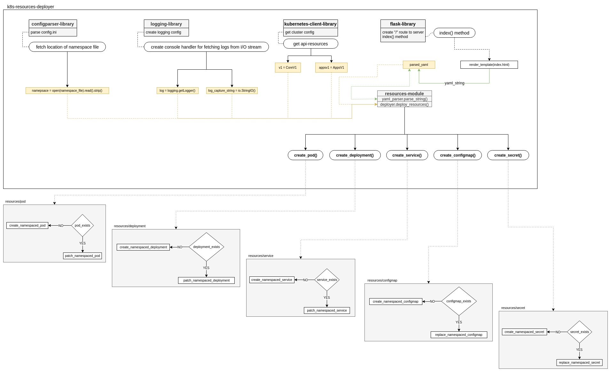

# k8s-resources-deployer Low Level Design
This document describes the Low Level Design of the `k8s-resources-deployer` i.e the design about the application itself and what approaches are used while developing it. 

## k8s-resources-deployer
The application is python based solution which provides a very simple web based form for users to provide kubernetes resources definition in the form of yaml. The tool, in turn parses the yaml definition and does the following:

- Figures out the resource type from the parsed yaml and calls the relevant method for deploying kubernetes resources. The currently kubernetes supported resources are:
  - Pod
  - Deployment
  - Service
  - Config Map
  - Secret
- The tool also checks for the if the namespace is provided in the resource definition and takes the following decisions:
  - If the namespace is not provided, the tool will pass the resource definition for further processing.
  - If the namespace in the resource definition matches the allowed namespace for deploying the resource, the tool will pass the resource definition for further processing.
  - If the namespace differs from the allowed namespace, the application will output the warning message on the webpage about the namepsace being different than the allowed one. The tool then replaces the namespace in the resource definition and passes the updated resource definition for further processing.
- The tool will process the resource definition received after namespace verification and proceed with resource deployment.
  - If the resource to be deployed is not available in the namespace, then it is created.
  - If the resource to be deployed is already available in the namespace, then it is updated with the latest resource definition.
- If the resource creation/upgradation is successful, the the success message will be printed on the webpage, otherwise the error logs will be displayed for further investigations.

---

# Application Design

The diagram below describes the the design along with explaining what role each part in the diagram is playing to make this solution complete:

The application starts with `app.py` file inside the k8s-resources-deployer directory and perform the following operations:

## Application Bootstrap
The appliction instantiates the instances from the following libraries:
- Logging
- Config Parser
- Kubernetes Client
- Flask

The details of the bootstrap are as follows:

### Logging
- The logging instance `log` is created and configured for logging message format and log level.
  - The log instance is used for sending logs to `stdout`.
- The instance of IOStream named `log_capture_string` is also created to be provided as a stream handler to logging instance for capturing logs. 
  - This instance will be used to capture the logs from `log` instance and will return them as a response to the request received from flask instance at later stages. *(requires improvement in future)*

### Config Parser
The config parser instance is created for parsing data from `config.ini` file. The config.ini file has information regarding the namespace as follows:

- The namespace is provided through `namespace` variable when used outside kubernetes cluster. *(requires future improvement to take value from environment variables if not provided)*
- The path is provided through `namespace_path_inside_pod` variable to fetch namespace inside the container when running inside the kubernetes cluster.

### Kubernetes Client
The kubernetes client configurations are loaded on the basis of availability of `KUBERNETES_SERVICE_HOST` environment variable to figure out if the resource is running inside the kubernetes cluster and performs the following operations:

 - If the container is running inside the kubernetes cluster, then the configurations are loaded through `load_incluster_config()` method and the namespace variable is created with by fetching namespace value from `namespace_path_inside_pod` path.
 - If the container is not running inside the kubernetes cluster, then the cluster configurations are loaded with `load_kube_config()` and namespace variable is instantiaed by taking value from `namespace` variable inside config.ini.

### Flask
The flask `app` is created with a `/` route and mapped to `index()` method for serving the html content through `render_templates()` method.

## Flask Application
The flask app runs to serve `/` route throught with the provided html templates.

### HTML Templates
The HTML templates reside inside templates directory inside `k8s-resources-deployer` and currently consists of only `index.html` page which does the following:
- Serve the web form to the user to input the yaml based resources definition if the request method is `GET`.
- If the request method is `POST`. then serve the web form to the user along with showing the status below the web form below the `h3` block ***Responses from Server Side***.

### / route
The `/` route is mapped to `index()` method which handles the backend logic for deploying kubernetes resources.

#### index() method
The index() method serves the web form available in `index.html` template through `render_templates()` when the request method is `GET`.

The `POST` request method requires some processing and performs the following operations:
- The yaml string provided in the POST request is first parsed to yaml through `yaml_parser.parse_string()` method.
  - If the string is valid yaml, then it is parsed, else error is displayed to the user.
  - The `parsed_yaml` is then provided as a paramter to deployer module.
- The deployer module is called to deploy the kubernetes resources and fetch the server side response through `deployer.deploy_resources()` method. The following parameters are required for this method:
  - parsed_yaml *(created in the previous step)*
  - logger *(created during application bootstrap as `log`)*
  - log_capture_string *(created during application bootstrap)*
  - api_v1 *(created during application bootstrap as `v1`)*
  - api_apps_v1 *(created during application bootstrap `appv1`)*
  - namespace *(created during application bootstrap)*
- The resources are then deployed through deployer module and the response is sent back as an additional parameter while rendering `index.html`.

### deployer.deploy_resources() method
The deploy_resources() deploys the kubernetes resource if it is of the following types:
- Pod *(method for deploying is create_pod()*)
- Deplyoment *(method for deploying is create_deployment()*)
- Service *(method for deploying is create_service()*)
- Config Map *(method for deploying is create_configmap()*)
- Secret *(method for deploying is create_secret()*)

The methods defined for deploying the above resources are defined with the same principle, which is mentioned below:
- Check for the resource through the corresponding `list_namespaced_[RESOURCE]` method.
- If the resource is not available, then deploy it through the corresponding `create_namespaces_[RESOURCE]`
- If the resource is already available and is of type ***pod, deployment or service***, then update the resource manifest through the corresponding `patch_namespaces_[RESOURCE]` method and redeploy.
- If the resource is already available and is of type ***configmap or secret***, then update the resource manifest through the corresponding `update_namespaces_[RESOURCE]` method and redeploy.
---